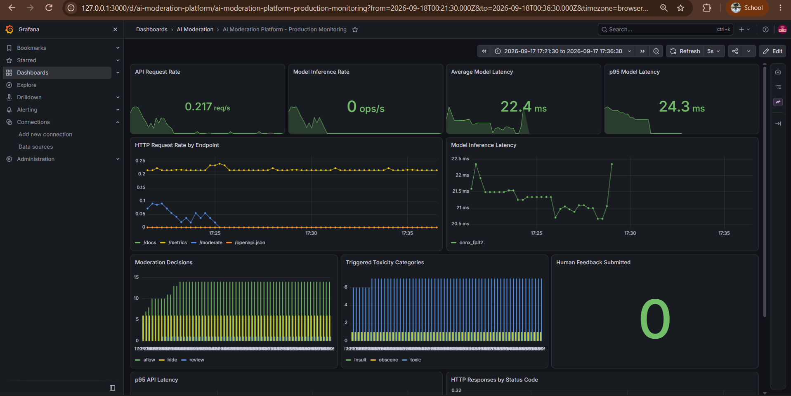

# 🛡️ AI Moderation Platform

### Production-Oriented Personalized Content Moderation with End-to-End MLOps

A production-oriented NLP platform for **real-time, personalized toxic-content moderation** built with FastAPI, Toxic-BERT, ONNX Runtime, PostgreSQL, MLflow, Docker, Prometheus, and Grafana.

Instead of stopping at model inference, this project implements the surrounding ML lifecycle: **optimization, evaluation, automated promotion gates, model registry, CI, load testing, persistent feedback, and production-style observability.**

---

## 🚀 Highlights

| Capability | Result |
|---|---|
| ⚡ Inference optimization | **5.60× faster** INT8 inference vs. PyTorch FP32 in local CPU benchmark |
| 📦 Model compression | **417.86 MB → 105.14 MB** (**74.84% smaller**) |
| 🎯 Quality preservation | Macro F1 **0.8477 → 0.8465** after INT8 quantization |
| 🧪 Evaluation | Deterministic **5,000-comment** FP32 vs. INT8 evaluation |
| 🚦 Model safety | Automated quality, latency, and size **promotion gates** |
| 🧬 Model lifecycle | MLflow experiment tracking + Model Registry + aliases |
| 📈 Load testing | **2,178 requests, 0 failures** in a 25-user ONNX test |
| 📊 Observability | Prometheus + Grafana for API, inference, and moderation telemetry |
| 🔄 CI | GitHub Actions runs automated tests and Docker builds |
| 🎛️ Personalization | Per-user moderation policies stored in PostgreSQL |
| 👥 Feedback loop | Predictions and human corrections persisted for future improvement |

> Benchmark and load-test results are measurements from the local test environment and should not be interpreted as universal hardware-independent performance claims.

---

# 🎯 The Problem

Most automated moderation systems make one platform-wide decision:

```text
Comment
   ↓
Moderation Model
   ↓
ALLOW / HIDE
```

But moderation preferences are not necessarily identical across users.

One creator may want insults filtered automatically, while another may only want threats and severe toxicity hidden.

This platform separates **ML prediction** from **product policy**:

```text
                         User Preferences
                               ↓
Incoming Comment → Toxicity Model → Policy Engine
                                      ↓
                              ALLOW / REVIEW / HIDE
```

The model estimates toxicity probabilities.

The policy engine determines how those predictions affect a particular user.

That means moderation behavior can change without retraining the underlying Transformer every time a user changes a preference.

---

# 🏗️ System Architecture

```text
                              Client
                                │
                                ▼
                         ┌─────────────┐
                         │   FastAPI   │
                         └──────┬──────┘
                                │
                 ┌──────────────┴──────────────┐
                 │                             │
                 ▼                             ▼
          ┌─────────────┐               ┌─────────────┐
          │ PostgreSQL  │               │ Toxic-BERT  │
          │             │               │ ONNX Runtime│
          │ Users       │               │ CPU         │
          │ Preferences │               └──────┬──────┘
          │ Predictions │                      │
          │ Feedback    │                      ▼
          └─────────────┘               ┌─────────────┐
                                        │Policy Engine│
                                        └──────┬──────┘
                                               │
                                               ▼
                                      ALLOW / REVIEW / HIDE
                                               │
                                               ▼
                                          /metrics
                                               │
                                               ▼
                                         Prometheus
                                               │
                                               ▼
                                            Grafana
```

The ML lifecycle runs alongside the serving architecture:

```text
PyTorch Baseline
       ↓
ONNX Export
       ↓
INT8 Quantization
       ↓
Quality Evaluation
       ↓
Performance Benchmark
       ↓
Automated Promotion Gate
       ↓
MLflow Experiment Tracking
       ↓
MLflow Model Registry
       ↓
@candidate
       ↓
Gated Promotion
       ↓
@production
```

---

# 🧠 Toxicity Model

The platform uses **`unitary/toxic-bert`** for multi-label toxicity classification.

It produces probabilities for six categories:

| Category | Description |
|---|---|
| `toxic` | General toxic language |
| `severe_toxic` | Extremely toxic language |
| `obscene` | Obscene content |
| `threat` | Threatening language |
| `insult` | Insulting language |
| `identity_hate` | Identity-targeted hateful language |

Example:

```json
{
  "toxic": 0.9878,
  "severe_toxic": 0.0425,
  "obscene": 0.7727,
  "threat": 0.0013,
  "insult": 0.9573,
  "identity_hate": 0.0133
}
```

The probabilities are not themselves the final product decision. They are passed to the personalized policy layer.

---

# 🎛️ Personalized Moderation

Each user has configurable moderation preferences stored in PostgreSQL.

Example:

```json
{
  "toxic": true,
  "severe_toxic": true,
  "obscene": false,
  "threat": true,
  "insult": true,
  "identity_hate": true
}
```

Therefore two users can receive the same model prediction while receiving different moderation outcomes.

```text
Toxicity Scores
      +
User Preferences
      ↓
 Policy Engine
      ↓
ALLOW / REVIEW / HIDE
```

This design separates:

```text
ML prediction ≠ product decision
```

---

# 🔄 Moderation Request Flow

```text
POST /moderate
      ↓
Validate request
      ↓
Load user
      ↓
Load moderation preferences
      ↓
Tokenize comment
      ↓
ONNX inference
      ↓
Six toxicity probabilities
      ↓
Personalized policy
      ↓
ALLOW / REVIEW / HIDE
      ↓
Persist prediction
      ↓
Record Prometheus telemetry
      ↓
Return response
```

---

# ⚡ Model Optimization

The project evaluates three inference configurations:

```text
PyTorch FP32
     ↓
ONNX FP32
     ↓
ONNX INT8
```

Each optimization stage is measured rather than assumed to be beneficial.

---

## 🚀 PyTorch → ONNX Runtime

The original Transformer was exported from PyTorch to ONNX.

Prediction sanity checks were performed before benchmarking.

Example:

```text
CATEGORY             PYTORCH      ONNX

toxic                 0.9878      0.9878
severe_toxic          0.0425      0.0425
obscene               0.7727      0.7727
threat                0.0013      0.0013
insult                 0.9573      0.9573
identity_hate          0.0133      0.0133
```

For these test inputs, outputs matched at the four-decimal precision displayed by the comparison script.

---

# 📊 Runtime Benchmark

One reproducible local CPU benchmark produced:

| Runtime | Average | p50 | p95 | p99 |
|---|---:|---:|---:|---:|
| PyTorch FP32 | 38.34 ms | 36.61 ms | 43.62 ms | 73.24 ms |
| ONNX FP32 | 15.88 ms | 14.31 ms | 23.29 ms | 25.71 ms |
| **ONNX INT8** | **6.84 ms** | **5.86 ms** | **10.71 ms** | **14.15 ms** |

Observed speedups:

```text
ONNX FP32 vs PyTorch  → 2.41×
ONNX INT8 vs PyTorch → 5.60×
ONNX INT8 vs FP32    → 2.32×
```

Benchmark results are stored in machine-readable form:

```text
benchmarks/raw/model_runtime.csv
```

---

# 📦 INT8 Quantization

Dynamic INT8 quantization reduced the ONNX artifact from:

```text
ONNX FP32
417.86 MB
     ↓
INT8 Quantization
     ↓
ONNX INT8
105.14 MB
```

| Model | Size |
|---|---:|
| ONNX FP32 | 417.86 MB |
| **ONNX INT8** | **105.14 MB** |

### **74.84% model-size reduction**

However, faster and smaller does not automatically mean production-ready.

Quantization can alter predictions, so the INT8 model must pass quality evaluation before promotion.

---

# 🧪 5,000-Comment Quality Evaluation

A deterministic **5,000-comment evaluation subset** was constructed from the Jigsaw Toxic Comment dataset.

The subset intentionally preserves positive examples for rare toxicity categories.

| Category | Positive Examples |
|---|---:|
| Toxic | 2,726 |
| Severe Toxic | 801 |
| Obscene | 2,080 |
| Threat | 478 |
| Insult | 2,028 |
| Identity Hate | 726 |

Both ONNX FP32 and INT8 are evaluated against the **same comments**.

> The evaluation subset intentionally oversamples positive/rare labels. These metrics characterize the controlled FP32-vs-INT8 comparison set rather than natural production class prevalence.

---

# 📈 FP32 vs. INT8 Quality

| Category | FP32 F1 | INT8 F1 | Change |
|---|---:|---:|---:|
| Toxic | 0.9696 | 0.9680 | -0.0016 |
| Severe Toxic | 0.5443 | 0.5402 | -0.0042 |
| Obscene | 0.9482 | 0.9477 | -0.0005 |
| Threat | 0.8690 | **0.8712** | +0.0022 |
| Insult | 0.9209 | 0.9198 | -0.0012 |
| Identity Hate | 0.8340 | 0.8320 | -0.0020 |

Aggregate metrics:

| Metric | ONNX FP32 | ONNX INT8 |
|---|---:|---:|
| Macro Precision | 0.8431 | **0.8442** |
| Macro Recall | **0.8564** | 0.8524 |
| Macro F1 | **0.8477** | 0.8465 |

### Macro F1 degradation: **0.0012**

```text
0.8477 → 0.8465
```

Evaluation artifacts:

```text
evaluation/results/
├── onnx_fp32_metrics.json
├── onnx_int8_metrics.json
├── comparison.csv
└── predictions.csv
```

---

# 🚦 Automated Model Promotion Gate

A candidate is not promoted simply because it is faster.

The promotion system enforces explicit version-controlled requirements:

```json
{
  "quality_gates": {
    "max_macro_f1_drop": 0.005,
    "max_category_f1_drop": 0.01,
    "max_macro_recall_drop": 0.01
  },
  "performance_gates": {
    "min_speedup": 1.25,
    "min_size_reduction_percent": 20.0
  }
}
```

The INT8 candidate produced:

```text
MODEL PROMOTION REPORT

Baseline : onnx_fp32
Candidate: onnx_int8

QUALITY
Macro F1             PASS   drop=0.0012
Macro Recall         PASS   drop=0.0040

CATEGORY F1
toxic                PASS
severe_toxic         PASS
obscene              PASS
threat               PASS
insult               PASS
identity_hate        PASS

PERFORMANCE
Speedup              PASS   2.40×

MODEL SIZE
Reduction            PASS   74.84%

OVERALL              PASS
```

The script exposes CI-compatible exit codes:

```text
0 → candidate passed
1 → candidate failed
```

This means the same quality gate can block future model releases automatically.

---

# 🧬 MLflow Experiment Tracking

MLflow tracks model experiments instead of relying on manually copied benchmark numbers.

Tracked information includes:

### Parameters

```text
runtime
base_model
precision
device
classification_threshold
evaluation_rows
```

### Metrics

```text
macro_precision
macro_recall
macro_f1

per-category precision
per-category recall
per-category F1

evaluation latency
model size
```

### Artifacts

```text
evaluation reports
benchmark results
comparison files
model artifacts
promotion reports
```

This provides reproducible comparison between FP32 and INT8 experiments.

---

# 🗂️ Model Registry & Production Promotion

The approved model is registered as:

```text
toxicity-moderation-model
```

The model lifecycle is:

```text
Evaluation
    ↓
Promotion Gate
    ↓
PASS
    ↓
MLflow Model Registry
    ↓
Version 1
    ↓
@candidate
    ↓
Gated Production Promotion
    ↓
@production
```

The production promotion script verifies that the candidate contains:

```text
promotion_gate = PASSED
```

before assigning the production alias.

This provides traceability between:

```text
Model Artifact
      ↕
Experiment
      ↕
Evaluation Metrics
      ↕
Promotion Decision
      ↕
Registered Version
      ↕
Production Alias
```

---

# 🔥 Load Testing with Locust

The API was tested under concurrent traffic using Locust.

### 25-user ONNX FP32 run

```text
Requests:       2,178
Failures:       0

Median:         35 ms
Average:        44.94 ms
p95:            100 ms
p99:            220 ms

Current RPS:    ~19.9
```

A prior PyTorch run under the intended comparison workload produced:

```text
Median:         120 ms
Average:        164.07 ms
p95:            390 ms
p99:            670 ms
RPS:            ~17.6
Failures:       0
```

Observed local end-to-end latency improvements:

```text
Average latency ↓ ~72.6%
p50 latency     ↓ ~70.8%
p95 latency     ↓ ~74.4%
p99 latency     ↓ ~67.2%
```

These results depend on hardware, concurrency, container state, workload, and runtime configuration.

---

# 📊 Production-Style Observability

The running application exposes both **traditional service telemetry and ML-specific telemetry** through Prometheus.

Grafana then visualizes the metrics through a provisioned dashboard.



### Dashboard Coverage

The dashboard monitors:

- **API request rate**
- **Traffic by endpoint**
- **Average model inference latency**
- **p95 model inference latency**
- **ONNX runtime latency over time**
- **Moderation decisions** (`allow`, `review`, `hide`)
- **Triggered toxicity categories**
- **Human feedback submissions**
- **p95 API latency**
- **HTTP responses by status code**

The monitoring path is:

```text
FastAPI
   │
   ├── HTTP telemetry
   ├── inference telemetry
   ├── moderation telemetry
   └── feedback telemetry
            ↓
         /metrics
            ↓
       Prometheus
            ↓
         Grafana
            ↓
   Live MLOps Dashboard
```

This creates visibility into both:

```text
SYSTEM HEALTH
request rate
latency
status codes

       +

MODEL / PRODUCT BEHAVIOR
inference latency
runtime
moderation decisions
toxicity categories
human feedback
```

The Grafana datasource and dashboard are provisioned from configuration files, allowing the monitoring environment to be recreated rather than configured manually.

---

# 🐘 PostgreSQL Persistence

The application persists:

```text
Users
Moderation Preferences
Predictions
Human Feedback
```

This enables a feedback loop:

```text
Comment
   ↓
Model Prediction
   ↓
Moderation Decision
   ↓
Stored Prediction
   ↓
Human Feedback
   ↓
Future Evaluation / Retraining Data
```

Database schema evolution is managed using **Alembic migrations**.

---

# 👥 Human Feedback Pipeline

Predictions receive persistent IDs.

Users or moderators can submit corrections:

```text
Prediction
     ↓
Human Review
     ↓
Corrected Decision / Category
     ↓
PostgreSQL
     ↓
Future Error Analysis / Retraining
```

This creates the foundation for:

- error analysis
- active learning
- retraining datasets
- drift investigation
- model improvement

The application is therefore structured as a **learning ML system**, not only a stateless inference endpoint.

---

# 🌐 REST API

FastAPI provides the serving layer.

Core endpoints:

```text
GET  /
GET  /health
GET  /ready
GET  /metrics

POST /users

GET  /users/{user_id}/preferences
PUT  /users/{user_id}/preferences

POST /moderate

GET  /predictions/{prediction_id}

POST /feedback
```

Interactive Swagger documentation:

```text
http://127.0.0.1:8000/docs
```

---

# ❤️ Liveness vs. Readiness

The platform distinguishes between process health and model-serving readiness.

### `/health`

Answers:

> Is the API process alive?

### `/ready`

Answers:

> Is the inference system actually ready to process requests?

Example:

```json
{
  "status": "ready",
  "model": "unitary/toxic-bert-onnx",
  "device": "cpu"
}
```

This distinction is important for production service orchestration and health checks.

---

# 🐳 Containerized Architecture

Docker Compose runs the local platform as four services:

```text
Docker Compose
│
├── moderation-api
│
├── moderation-postgres
│
├── moderation-prometheus
└── moderation-grafana
```

Model artifacts are intentionally separated from the application image and mounted read-only at runtime:

```text
Application Image
       +
Approved Model Artifact
       ↓
Running ML Service
```

This prevents large model binaries from bloating Git history or forcing every application-code change to rebuild the model into the image.

---

# 🔌 Runtime Abstraction

The API is separated from the underlying inference implementation:

```text
FastAPI
   ↓
get_moderation_model()
   ↓
MODEL_RUNTIME
   │
   ├── PyTorch
   └── ONNX
```

Lazy imports allow the production ONNX container to avoid requiring PyTorch.

This separates development/export dependencies from serving dependencies and keeps the inference image focused on the runtime it actually needs.

---

# 🧪 Automated Testing

The project includes tests covering:

- API root
- health
- readiness
- safe-comment moderation
- toxic-comment moderation
- request validation
- unknown users
- user creation
- user preferences
- policy behavior

Current suite:

```text
13 passed
```

Run:

```bash
python -m pytest -v
```

---

# 🔄 GitHub Actions CI

Every push and pull request runs a clean CI pipeline:

```text
Git Push / Pull Request
          ↓
       Checkout
          ↓
     Python 3.13
          ↓
 Install Dependencies
          ↓
        pytest
          ↓
    Docker Build
          ↓
       PASS / FAIL
```

The project deliberately separates the **software release lifecycle** from the **model lifecycle**.

### Software CI

```text
Application Code
      ↓
Automated Tests
      ↓
Docker Build
```

### Model Lifecycle

```text
Candidate Model
      ↓
Evaluation
      ↓
Benchmarking
      ↓
Promotion Gate
      ↓
Model Registry
      ↓
@candidate
      ↓
@production
```

This reflects an important MLOps principle: application code and model artifacts are related, but they do not necessarily share the same release lifecycle.

---

# 🧰 Technology Stack

| Area | Technology |
|---|---|
| Language | Python 3.13 |
| NLP | Toxic-BERT |
| Transformers | Hugging Face Transformers |
| Baseline Runtime | PyTorch |
| Optimized Runtime | ONNX Runtime |
| Quantization | ONNX Runtime INT8 |
| API | FastAPI |
| Validation | Pydantic |
| Database | PostgreSQL |
| ORM | SQLAlchemy |
| Migrations | Alembic |
| Containers | Docker / Docker Compose |
| Experiment Tracking | MLflow |
| Model Registry | MLflow Model Registry |
| Monitoring | Prometheus |
| Dashboards | Grafana |
| Load Testing | Locust |
| Evaluation | scikit-learn |
| Data Processing | pandas |
| Testing | pytest |
| CI | GitHub Actions |

---

# 📁 Project Structure

```text
ai-moderation-platform/
│
├── .github/
│   └── workflows/
│       └── ci.yml
│
├── alembic/
│   └── versions/
│
├── assets/
│   └── grafana-dashboard.png
│
├── benchmarks/
│   └── raw/
│
├── config/
│   └── promotion_gate.json
│
├── docker/
│   └── Dockerfile
│
├── evaluation/
│   ├── data/                    # ignored downloaded dataset
│   └── results/
│
├── load_tests/
│   ├── locustfile.py
│   └── test_comments.json
│
├── monitoring/
│   ├── prometheus.yml
│   └── grafana/
│       ├── dashboards/
│       │   └── moderation-dashboard.json
│       └── provisioning/
│           ├── dashboards/
│           └── datasources/
│
├── models/                      # ignored local model artifacts
│   ├── onnx/
│   └── onnx_int8/
│
├── scripts/
│   ├── benchmark.py
│   ├── check_promotion.py
│   ├── compare_quantization.py
│   ├── compare_runtimes.py
│   ├── create_eval_subset.py
│   ├── download_eval_data.py
│   ├── evaluate_models.py
│   ├── export_onnx.py
│   ├── log_mlflow_experiments.py
│   ├── promote_to_production.py
│   ├── quantize_onnx.py
│   └── register_model.py
│
├── src/
│   ├── api/
│   ├── database/
│   ├── model/
│   └── monitoring/
│
├── tests/
│
├── docker-compose.yml
├── requirements.txt
├── requirements-api.txt
├── requirements-dev.txt
└── pyproject.toml
```

---

# ▶️ Getting Started

## 1. Clone

```bash
git clone <repository-url>
cd ai-moderation-platform
```

## 2. Create a virtual environment

Windows:

```powershell
python -m venv .venv
.\.venv\Scripts\Activate.ps1
```

Install dependencies:

```bash
python -m pip install -r requirements.txt
```

> Large model artifacts and local environment configuration are intentionally excluded from Git. Model export/quantization scripts are provided to reproduce the artifacts.

---

# 🐳 Start the Platform

Make sure Docker Desktop is running.

```bash
docker compose up -d
```

Check:

```bash
docker compose ps
```

Expected services:

```text
moderation-api
moderation-postgres
moderation-prometheus
moderation-grafana
```

Local interfaces:

| Service | URL |
|---|---|
| Swagger API | `http://127.0.0.1:8000/docs` |
| Prometheus Metrics | `http://127.0.0.1:8000/metrics` |
| Prometheus | `http://127.0.0.1:9090` |
| Grafana | `http://127.0.0.1:3000` |
| MLflow UI | `http://127.0.0.1:5000` when started |

---

# 🧪 Run Tests

```bash
python -m pytest -v
```

---

# ⚡ Export & Optimize the Model

Export to ONNX:

```bash
python -m scripts.export_onnx
```

Compare PyTorch and ONNX predictions:

```bash
python -m scripts.compare_runtimes
```

Quantize:

```bash
python -m scripts.quantize_onnx
```

Compare FP32 and INT8:

```bash
python -m scripts.compare_quantization
```

Benchmark:

```bash
python -m scripts.benchmark
```

---

# 🧪 Evaluate Model Quality

Prepare evaluation data:

```bash
python -m scripts.download_eval_data
python -m scripts.create_eval_subset
```

Evaluate:

```bash
python -m scripts.evaluate_models
```

---

# 🚦 Run the Promotion Gate

```bash
python -m scripts.check_promotion
```

```text
PASS → exit code 0
FAIL → exit code 1
```

---

# 📊 MLflow Workflow

Log experiments:

```bash
python -m scripts.log_mlflow_experiments
```

Start MLflow:

```bash
python -m mlflow ui --backend-store-uri sqlite:///mlflow.db --port 5000
```

Register the approved candidate:

```bash
python -m scripts.register_model
```

Promote an approved candidate to the production alias:

```bash
python -m scripts.promote_to_production
```

---

# 🔥 Load Testing

Interactive Locust:

```bash
python -m locust \
  -f load_tests/locustfile.py \
  --host http://127.0.0.1:8000
```

Open:

```text
http://localhost:8089
```

Example headless run:

```bash
python -m locust \
  -f load_tests/locustfile.py \
  --headless \
  -u 25 \
  -r 5 \
  -t 2m \
  --host http://127.0.0.1:8000 \
  --csv benchmarks/raw/onnx_25_users
```

---

# 🔐 Repository Hygiene

Large, generated, private, and local-state artifacts are intentionally excluded:

```text
models/
evaluation/data/
mlflow.db
mlruns/
mlartifacts/
.env
.venv/
__pycache__/
```

This prevents:

- large model binaries from bloating Git history
- evaluation datasets from being accidentally committed
- local MLflow state from entering source control
- secrets from being exposed
- generated Python bytecode from polluting commits

---

# 💡 Engineering Principles Demonstrated

### 1. Model accuracy is only one dimension

Production ML also requires:

```text
quality
latency
throughput
artifact size
reliability
observability
testing
versioning
release safety
```

### 2. Faster does not automatically mean better

INT8 was substantially faster and smaller, but promotion was blocked until its quality was measured.

```text
Optimize
   ↓
Benchmark
   ↓
Evaluate
   ↓
Apply Gates
   ↓
Register
   ↓
Promote
```

### 3. Tail latency matters

The project measures:

```text
average
p50
p95
p99
```

rather than relying only on average latency.

### 4. Prediction and policy are separate

```text
Model Probability
       ≠
Product Decision
```

This allows personalized moderation without retraining the classifier for every user's preferences.

### 5. Model releases need measurable gates

Candidate models must satisfy explicit quality and performance requirements before receiving a production alias.

### 6. Observability must include ML behavior

Traditional API metrics alone do not explain model behavior.

The platform therefore monitors both:

```text
Service Metrics
+
Inference Metrics
+
Moderation Metrics
+
Feedback Metrics
```

### 7. Reproducibility matters

Evaluation results, benchmark outputs, dashboard configuration, promotion criteria, and CI configuration are represented as code or machine-readable artifacts rather than relying only on screenshots and manual notes.

---

# 🌟 Why This Is More Than a Model Demo

A basic ML demo often looks like:

```text
Load pretrained model
      ↓
predict()
      ↓
REST endpoint
```

This project instead implements:

```text
                       DATA
                        ↓
                    ML MODEL
                        ↓
                  OPTIMIZATION
                        ↓
                   EVALUATION
                        ↓
                  BENCHMARKING
                        ↓
                PROMOTION GATES
                        ↓
               EXPERIMENT TRACKING
                        ↓
                 MODEL REGISTRY
                        ↓
               PRODUCTION ALIAS
                        ↓
                     SERVING
                        ↓
                   PERSISTENCE
                        ↓
                    FEEDBACK
                        ↓
                  OBSERVABILITY
                        ↓
                 FUTURE RETRAINING
```

The central engineering question is not simply:

> **Can a Transformer detect toxic text?**

It is:

> **Can we build a measurable, personalized, reproducible, optimized, observable, and safely upgradable ML system around it?**

---

# 📌 Project Status

## Implemented

- [x] Toxic-BERT multi-label inference
- [x] Personalized moderation policies
- [x] FastAPI serving
- [x] PostgreSQL persistence
- [x] SQLAlchemy ORM
- [x] Alembic migrations
- [x] Prediction history
- [x] Human feedback pipeline
- [x] PyTorch baseline
- [x] ONNX export
- [x] PyTorch vs. ONNX validation
- [x] ONNX Runtime optimization
- [x] INT8 quantization
- [x] Reproducible latency benchmarking
- [x] 5,000-comment quality evaluation
- [x] Precision / Recall / F1 evaluation
- [x] Automated model promotion gate
- [x] MLflow experiment tracking
- [x] MLflow Model Registry
- [x] Versioned candidate model
- [x] Gated `@production` model promotion
- [x] Docker / Docker Compose
- [x] Automated test suite
- [x] GitHub Actions CI
- [x] Locust load testing
- [x] Prometheus instrumentation
- [x] ML-specific production telemetry
- [x] Grafana monitoring dashboard
- [x] Provisioned monitoring configuration

## Future Extensions

- [ ] Drift detection
- [ ] Automated retraining
- [ ] Champion/challenger rollout
- [ ] Remote artifact registry
- [ ] Cloud deployment
- [ ] Model-release CI/CD
- [ ] Streaming moderation with Kafka/event queues

---

# ⚠️ Responsible Use

Automated toxicity classifiers are imperfect.

Language is contextual, culturally dependent, and constantly evolving. Sarcasm, quotations, reclaimed language, slang, and friendly banter can all produce unexpected predictions.

For this reason, the platform includes:

- configurable user policies
- human feedback
- per-category evaluation
- explicit model-quality gates
- model versioning
- production telemetry
- future retraining hooks

Model probabilities should not be treated as unquestionable ground truth, particularly in high-impact moderation decisions.

---

# 👨‍💻 Author

Built as an end-to-end **Machine Learning Engineering / MLOps portfolio project** exploring how modern NLP models can be optimized, evaluated, benchmarked, versioned, served, monitored, and safely promoted through a production-oriented model lifecycle.
